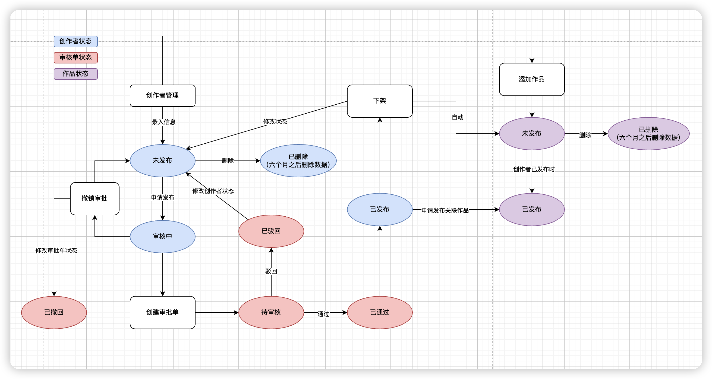
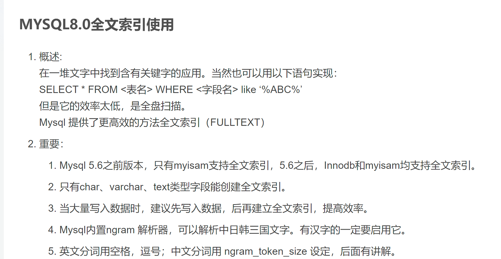
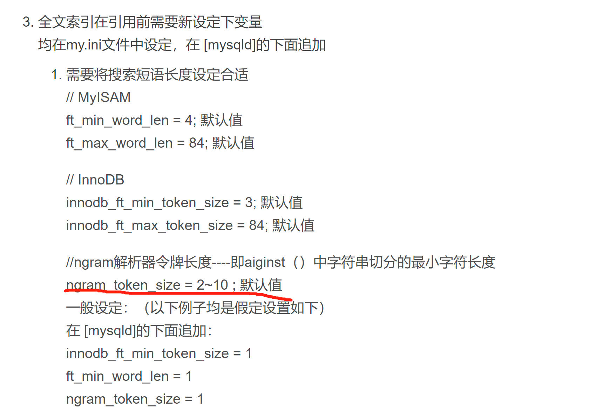
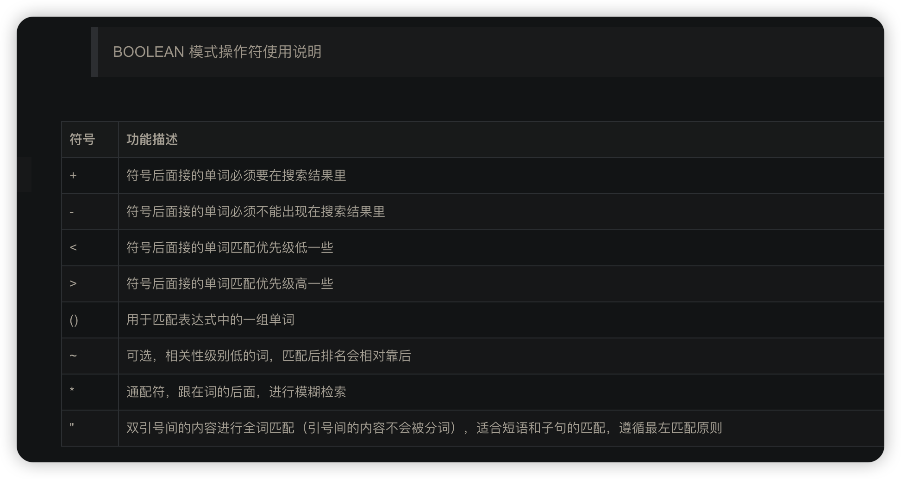

### 数据库

#### op_creator（创作者表）

```mysql
CREATE TABLE `op_creator` (
  `id` bigint NOT NULL AUTO_INCREMENT COMMENT '创作者编号id主键',
  `creator_name` varchar(255) CHARACTER SET utf8mb4 COLLATE utf8mb4_unicode_ci NOT NULL COMMENT '创作者名称',
  `profile_photo` varchar(511) CHARACTER SET utf8mb4 COLLATE utf8mb4_unicode_ci NOT NULL COMMENT '用户头像地址',
  `grade` tinyint(1) NOT NULL COMMENT '评级（1:S,2:A,3:B）',
  `area_code` varchar(32) CHARACTER SET utf8mb4 COLLATE utf8mb4_unicode_ci NOT NULL COMMENT '地区编码',
  `type` varchar(10) COLLATE utf8mb4_unicode_ci NOT NULL COMMENT '类型（CCI ,CCC,CCV,CCJ）',
  `scale` tinyint NOT NULL COMMENT '规模（1:独立创作者,2:2-4人工作室,3:>5人公司）',
  `creator_status` tinyint DEFAULT NULL COMMENT '创作者状态（1:未发布，2审核中，3已发布，4已删除）',
  `tag` varchar(255) COLLATE utf8mb4_unicode_ci DEFAULT NULL COMMENT '标签',
  `remark` varchar(255) COLLATE utf8mb4_unicode_ci DEFAULT NULL COMMENT '描述信息',
  `create_time` datetime NOT NULL DEFAULT CURRENT_TIMESTAMP COMMENT '创建时间',
  `update_time` datetime NOT NULL DEFAULT CURRENT_TIMESTAMP ON UPDATE CURRENT_TIMESTAMP COMMENT '最后一次更新时间',
  `create_user` bigint DEFAULT NULL COMMENT '创建用户id',
  `update_user` bigint DEFAULT NULL COMMENT '最后更新用户id',
  PRIMARY KEY (`id`),
  FULLTEXT KEY `index_name` (`creator_name`) /*!50100 WITH PARSER `ngram` */ 
) ENGINE=InnoDB AUTO_INCREMENT=6 DEFAULT CHARSET=utf8mb4 COLLATE=utf8mb4_unicode_ci COMMENT='创作者表';
```

#### op_creator_works（创作者作品表）

```mysql
CREATE TABLE `op_creator_works` (
  `id` bigint NOT NULL AUTO_INCREMENT COMMENT '创作者作品id主键',
  `creator_id` bigint DEFAULT NULL COMMENT '创作者id',
  `works_id` bigint DEFAULT NULL COMMENT '作品id',
  `create_time` datetime NOT NULL DEFAULT CURRENT_TIMESTAMP COMMENT '创建时间',
  `create_user` bigint DEFAULT NULL COMMENT '创建用户id',
  PRIMARY KEY (`id`)
) ENGINE=InnoDB DEFAULT CHARSET=utf8mb4 COLLATE=utf8mb4_unicode_ci COMMENT='创作者作品表';
```

#### ad_process（审核主表）

```mysql
CREATE TABLE `ad_process` (
  `id` bigint NOT NULL AUTO_INCREMENT COMMENT '审核单id主键',
  `process_num` varchar(255) COLLATE utf8mb4_unicode_ci NOT NULL COMMENT '审核单编号(规则：固定字母“FB” + 生成审核单的日期 + 自递增序号（四位数字))',
  `type` tinyint(1) NOT NULL COMMENT '审核类型(1:创作者发布)',
  `status` tinyint(1) NOT NULL COMMENT '审核状态（1:待审核，2:已驳回，3:已通过，4:已撤回）',
  `create_time` datetime NOT NULL DEFAULT CURRENT_TIMESTAMP COMMENT '创建时间',
  `create_user` bigint NOT NULL COMMENT '创建用户id',
  `update_time` datetime DEFAULT CURRENT_TIMESTAMP ON UPDATE CURRENT_TIMESTAMP COMMENT '审核时间',
  `update_user` bigint DEFAULT NULL COMMENT '审核人',
  `remark` varchar(255) COLLATE utf8mb4_unicode_ci DEFAULT NULL COMMENT '审核备注',
  PRIMARY KEY (`id`) USING BTREE
) ENGINE=InnoDB DEFAULT CHARSET=utf8mb4 COLLATE=utf8mb4_unicode_ci COMMENT='审核主表';
```

#### ad_process_creator（创作者类审核详情表）

```mysql
CREATE TABLE `ad_process_creator` (
  `id` bigint NOT NULL AUTO_INCREMENT COMMENT '创作者类审核单id主键',
  `creator_id` bigint NOT NULL COMMENT '创作者id',
  `creator_name` varchar(255) COLLATE utf8mb4_unicode_ci NOT NULL COMMENT '创作者名称',
  `relation_works` varchar(255) CHARACTER SET utf8mb4 COLLATE utf8mb4_unicode_ci NOT NULL COMMENT '关联作品id(逗号（,）分割)',
  PRIMARY KEY (`id`)
) ENGINE=InnoDB DEFAULT CHARSET=utf8mb4 COLLATE=utf8mb4_unicode_ci COMMENT='创作者类审核详情表';
```

### 状态流转图



### 接口梳理

- 创作者列表（支持编号，名称模糊搜索，支持筛选）
- 添加创作者
- 编辑创作者
- 申请发布--》生成审批单
- 创作者删除
- 创作者下架
- 创作者撤销发布--》撤销审批单
- 创作者详情（创作者相关）
- 添加创作者和作品关联关系--石朋调用

### 扩展知识

```mysql
#全文索引，后面需要添加 WITH PARSER ngram;支持中文
alter table op_creator add fulltext index_name(`creator_name`) WITH PARSER ngram;
#全文索引默认支持字符2-10字符
#示例用法
select * from op_creator
where match(creator_name) against('+胡歌' IN BOOLEAN MODE);
```





