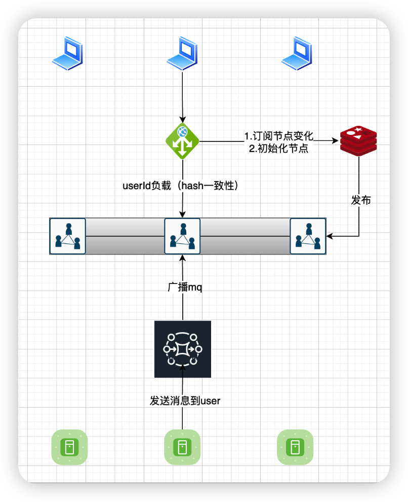
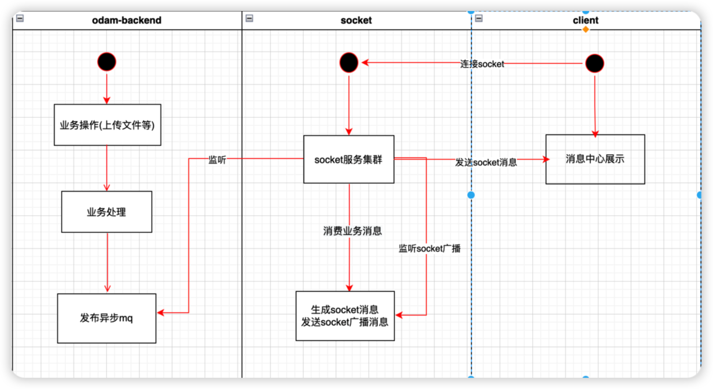

## 数据库

### bk_message_template

```sql
CREATE TABLE `sc_message_template` (
  `id` bigint NOT NULL AUTO_INCREMENT COMMENT '消息模板id',
  `name` varchar(20) CHARACTER SET utf8mb4 COLLATE utf8mb4_unicode_ci NOT NULL COMMENT '模板名称',
  `template_code` varchar(50) CHARACTER SET utf8mb4 COLLATE utf8mb4_unicode_ci NOT NULL COMMENT '模板code',
  `template_zh` varchar(255) CHARACTER SET utf8mb4 COLLATE utf8mb4_unicode_ci NOT NULL COMMENT '模板字符串',
  `template_en` varchar(255) CHARACTER SET utf8mb4 COLLATE utf8mb4_unicode_ci NOT NULL COMMENT '模板字符串',
  `message_to` varchar(100) CHARACTER SET utf8mb4 COLLATE utf8mb4_unicode_ci NOT NULL COMMENT '消息接受者，多个逗号分割\n项目所有成员（ALL_PROJECT_USER）\n项目管理员（PROJECT_ADMIN）\n团队所有成员（ALL_TEAM_USER）\n团队管理员（TEAM_ADMIN）\n其他（OTHER）',
  `message_type` varchar(20) CHARACTER SET utf8mb4 COLLATE utf8mb4_unicode_ci NOT NULL COMMENT '消息类型\n项目动态（PROJECT）\n团队动态（TEAM）\n我关注的（FOLLOW）',
  `template_status` tinyint NOT NULL DEFAULT '1' COMMENT '模板状态（1启用，0禁用）',
  `valid_time` datetime NOT NULL DEFAULT CURRENT_TIMESTAMP COMMENT '生效时间',
  `invalid_time` datetime NOT NULL DEFAULT '2100-01-01 00:00:00' COMMENT '失效时间',
  `valid_duration` tinyint NOT NULL DEFAULT '30' COMMENT '消息时效（单位天），0永久有效',
  `create_time` datetime NOT NULL DEFAULT CURRENT_TIMESTAMP COMMENT '创建时间',
  `update_time` datetime NOT NULL DEFAULT CURRENT_TIMESTAMP ON UPDATE CURRENT_TIMESTAMP COMMENT '修改时间',
  `create_user` bigint NOT NULL COMMENT '创建用户id',
  `update_user` bigint DEFAULT NULL COMMENT '最后更新用户id',
  PRIMARY KEY (`id`) USING BTREE,
  UNIQUE KEY `uk_template_code` (`template_code`) USING BTREE COMMENT '模板code唯一索引'
) ENGINE=InnoDB AUTO_INCREMENT=28 DEFAULT CHARSET=utf8mb4 COLLATE=utf8mb4_unicode_ci COMMENT='消息模板表';
```

### sc_message

```sql
CREATE TABLE `sc_message` (
  `id` bigint NOT NULL AUTO_INCREMENT COMMENT '消息id',
  `template_code` varchar(50) COLLATE utf8mb4_unicode_ci NOT NULL COMMENT '消息模板code',
  `template_param` json DEFAULT NULL COMMENT '消息模板参数(k-v)',
  `create_time` datetime NOT NULL DEFAULT CURRENT_TIMESTAMP COMMENT '创建时间',
  `create_user` bigint NOT NULL COMMENT '创建用户id',
  PRIMARY KEY (`id`)
) ENGINE=InnoDB AUTO_INCREMENT=4825 DEFAULT CHARSET=utf8mb4 COLLATE=utf8mb4_unicode_ci COMMENT='消息表';
```

### sc_message_read

```sql
CREATE TABLE `sc_message_user` (
  `id` bigint NOT NULL AUTO_INCREMENT COMMENT '消息已读表',
  `template_code` varchar(50) CHARACTER SET utf8mb4 COLLATE utf8mb4_unicode_ci NOT NULL COMMENT '消息模板code',
  `message_id` bigint NOT NULL COMMENT '消息id',
  `from_id` bigint NOT NULL COMMENT '消息来源id（0:系统）',
  `to_id` bigint NOT NULL COMMENT '消息目标id',
  `read_status` tinyint NOT NULL DEFAULT '1' COMMENT '消息状态（1未读，0已读）',
  `invalid_time` datetime NOT NULL DEFAULT '2100-01-01 00:00:00' COMMENT '失效时间',
  PRIMARY KEY (`id`) USING BTREE
) ENGINE=InnoDB AUTO_INCREMENT=9041 DEFAULT CHARSET=utf8mb4 COLLATE=utf8mb4_unicode_ci COMMENT='消息已读表';
```

## websocket

#### 选型：netty-websocket-spring-boot-starter

- 优势：基于netty，轻量

## 集群方案

#### websocket自定义集群负载：（可采用腾讯负载均衡）

- websocket节点上下线发布订阅
- redis存储websocket节点
- 初始化redis查询节点，构造hash环
- 请求的时候，通过userId，一致性hash负载到对应节点

#### websocket集群通信

- 服务端通知客户端，先发送rabbitmq消息，广播到所有socket节点
- socket服务器节点监听消息，根据userid寻找对应的本地tcp通道，发送消息

## socket集群架构图



## 业务流程图



## **业务mq消息设计**

#### topic：

- output_backend_business->input_backend_business

#### 消息体：

```java
package com.output.odam.common.message;

import com.output.odam.common.enums.EBusinessTypeEnums;
import io.swagger.annotations.ApiModel;
import io.swagger.annotations.ApiModelProperty;
import lombok.Data;
import lombok.experimental.Accessors;

import java.util.Set;

/**
 * 业务消息实体
 * @author yinmengqi
 * @version 1.0
 * @date 2022/10/28 10:51
 */
@Data
@Accessors(chain = true)
@ApiModel(value = "业务消息实体", description = "业务消息实体")
public class BusinessMessage {

    @ApiModelProperty(value = "业务创建人")
    private Long userId;
    @ApiModelProperty(value = "业务类型")
    private EBusinessTypeEnums businessType;
    @ApiModelProperty(value = "资源类消息体")
    private BusinessResource resource;
    @ApiModelProperty(value = "文件类消息体")
    private BusinessFile file;
    @ApiModelProperty(value = "项目类消息体")
    private BusinessProject project;
    @ApiModelProperty(value = "团队类消息体")
    private BusinessTeam team;

    @Data
    @Accessors(chain = true)
    @ApiModel(value = "资源类", description = "资源类")
    public static class BusinessResource {
        @ApiModelProperty(value = "关注人id集合")
        private Set<Long> follow;
        @ApiModelProperty(value = "资源id")
        private Long resourceId;
        @ApiModelProperty(value = "创建人")
        private String userName;
        @ApiModelProperty(value = "资源名")
        private String resourceName;
        @ApiModelProperty(value = "上级资源名")
        private String parentResourceName;
    }

    @Data
    @Accessors(chain = true)
    @ApiModel(value = "文件类", description = "文件类")
    public static class BusinessFile{
        @ApiModelProperty(value = "关注人id集合")
        private Set<Long> follow;
        @ApiModelProperty(value = "文件id")
        private Long fileId;
        @ApiModelProperty(value = "被评论人userId")
        private Long userId;
        @ApiModelProperty(value = "评论人用户名")
        private String userName;
        @ApiModelProperty(value = "文件名")
        private String fileName;
        @ApiModelProperty(value = "评论")
        private String comment;
    }

    @Data
    @Accessors(chain = true)
    @ApiModel(value = "项目类", description = "项目类")
    public static class BusinessProject{
        @ApiModelProperty(value = "项目id")
        private Long projectId;
        @ApiModelProperty(value = "操作人")
        private String optName;
        @ApiModelProperty(value = "被操作人")
        private String userName;
        @ApiModelProperty(value = "被操作人Id")
        private Long userId;
        @ApiModelProperty(value = "项目名")
        private String projectName;
        @ApiModelProperty(value = "项目角色名")
        private String roleName;
    }

    @Data
    @Accessors(chain = true)
    @ApiModel(value = "团队类", description = "团队类")
    public static class BusinessTeam{
        @ApiModelProperty(value = "团队id")
        private Long teamId;
        @ApiModelProperty(value = "操作人")
        private String optName;
        @ApiModelProperty(value = "被操作人Id")
        private Long userId;
        @ApiModelProperty(value = "被操作人")
        private String userName;
        @ApiModelProperty(value = "项目角色名")
        private String roleName;
    }
}
```

```java
package com.output.odam.common.enums;

/**
 * odam业务操作类型枚举
 * @author yinmengqi
 * @version 1.0
 * @date 2022/10/12 14:11
 */
public enum EBusinessTypeEnums {
    /************************************************项目动态************************************************/
    //创建文件夹
    PROJECT_CREATE_FOLDER,
    //创建文件
    PROJECT_CREATE_FILE,
    //删除文件夹
    PROJECT_DELETE_FOLDER,
    //删除文件
    PROJECT_DELETE_FILE,
    //移动资源
    PROJECT_MOVE,
    //copy资源
    PROJECT_COPY,
    //更新版本
    PROJECT_UPDATE_VERSION,
    //文件评论
    PROJECT_FILE_COMMENT,
    //回复评论
    PROJECT_FILE_REPLY_COMMENT,
    /************************************************团队动态************************************************/
    //创建项目
    TEAM_CREATE_PROJECT,
    //删除项目
    TEAM_DELETE_PROJECT,
    //邀请成员
    TEAM_INVITE_USER,
    //更新成员角色
    TEAM_UPDATE_USER_ROLE,
    //邀请项目成员
    TEAM_INVITE_PROJECT_USER,
    //更新项目成员角色
    TEAM_UPDATE_PROJECT_USER_ROLE,
    //删除成员
    TEAM_DELETE_USER,
    //删除项目成员
    TEAM_DELETE_PROJECT_USER;
}
```

## socket广播消息设计

#### topic：

- output_socket_message->input_socket_message

#### 消息体：

```java
package com.output.odam.api.socket.vo;

import com.output.odam.api.backend.vo.BaseUserVO;
import com.output.odam.common.enums.EMessageTypeEnums;
import io.swagger.annotations.ApiModel;
import io.swagger.annotations.ApiModelProperty;
import lombok.Data;
import lombok.experimental.Accessors;

import java.time.LocalDateTime;
import java.util.Map;
import java.util.Set;

/**
 * @author yinmengqi
 * @version 1.0
 * @date 2022/9/23 10:52
 */
@Data
@Accessors(chain = true)
@ApiModel(value = "消息发送实体", description = "消息发送实体")
public class MessageSendVO {
    @ApiModelProperty(value = "消息用户id")
    private Set<Long> userIds;
    @ApiModelProperty(value = "用户的消息id")
    private Map<Long,Long> userMessageIds;
    @ApiModelProperty(value = "消息类型")
    private EMessageTypeEnums type;
    @ApiModelProperty(value = "消息模板内容-中文")
    private String templateZh;
    @ApiModelProperty(value = "消息模板内容-英文")
    private String templateEn;
    @ApiModelProperty(value = "消息模板内容")
    private Map<String, Object> param;
    @ApiModelProperty(value = "消息来源id")
    private BaseUserVO fromId;
    @ApiModelProperty(value = "时间")
    private LocalDateTime dateTime;
}
```

## socket前端展示VO

```java
package com.output.odam.api.socket.vo;

import com.output.odam.api.backend.vo.BaseUserVO;
import com.output.odam.common.enums.EMessageTypeEnums;
import io.swagger.annotations.ApiModel;
import io.swagger.annotations.ApiModelProperty;
import lombok.Data;
import lombok.experimental.Accessors;

import java.time.LocalDateTime;

/**
 * @author yinmengqi
 * @version 1.0
 * @date 2022/11/3 15:42
 */
@Data
@Accessors(chain = true)
@ApiModel(value = "消息列表实体", description = "消息列表实体")
public class MessageVO {
    @ApiModelProperty(value = "用户消息id")
    private Long id;
    @ApiModelProperty(value = "消息类型")
    private EMessageTypeEnums type;
    @ApiModelProperty(value = "消息来源人")
    private BaseUserVO fromUser;
    @ApiModelProperty(value = "时间")
    private LocalDateTime dateTime;
    @ApiModelProperty(value = "消息模板内容")
    private String content;
    @ApiModelProperty(value = "消息状态（1未读，0已读）")
    private Integer status;
}
```

## socket认证方式

```java
wss://dev-odam.byoutput.com:28086/odam?language=language_zh
子协议：odam端登录所得token，feign接口验证token，无效则不予连接
```

